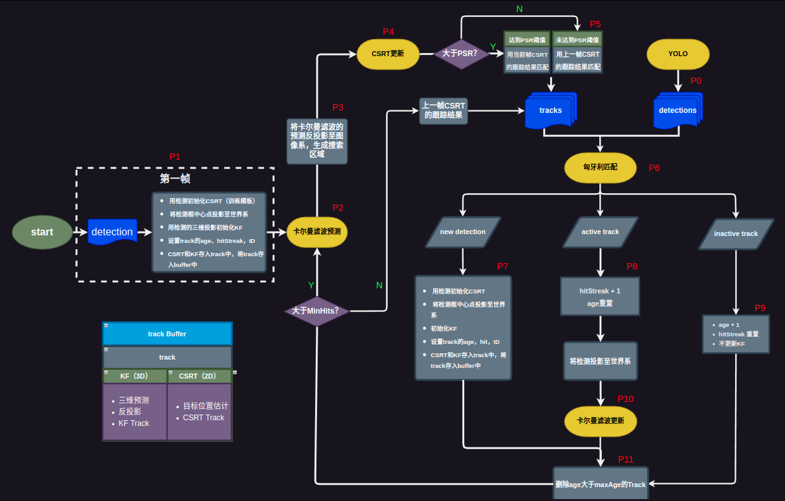

# Incorporating Camera Pose Into CSRT

## Quickly Start

preparation:

```bash
cd your_work_space
git clone https://github.com/fbh16/csrt_with_camera_pose.git
```

```bash
cd your_work_space
git clone https://github.com/npu-ius-lab/npurobocourse_sim.git
```

```bash
cd your_work_space
git clone https://github.com/fbh16/yolov8.git
```

start the simulation environment:

```bash
roslaunch hector_quadrotor_demo outdoor_flight_gazebo.launch
```

start the detector:

```bash
roslaunch yolov8_ros v8.launch 
```

start the tracker:

```bash
roslaunch csrt_with_camera_pose fst.launch
```

## Result


## Framework

